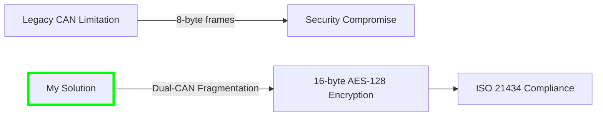
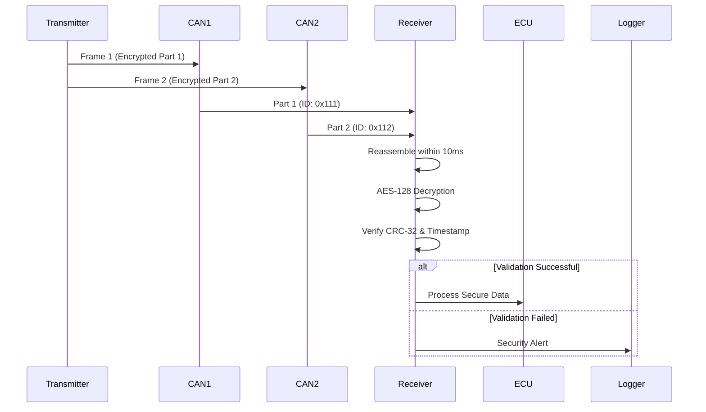
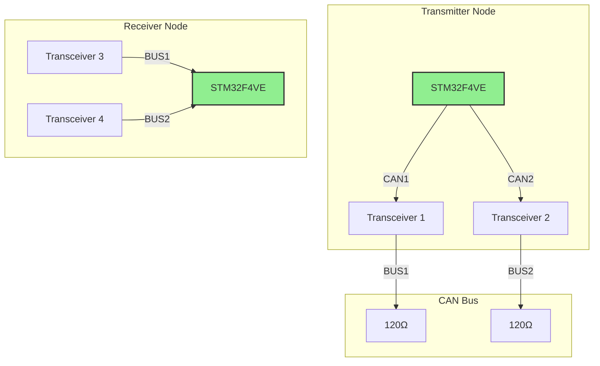

# secure_dual_can_comm_with_AES128
**ISO/SAE 21434 Compliant Automotive Cybersecurity Solution for Legacy CAN Systems**

[](https://en.wikipedia.org/wiki/ISO/SAE_21434)
[](https://www.st.com/en/microcontrollers-microprocessors/stm32f4-series.html)
[](https://opensource.org/licenses/MIT)

## Project Overview

This project implements an innovative cybersecurity solution for **legacy automotive CAN systems** (CAN 2.0B) that overcomes the critical 8-byte frame limitation to provide ISO/SAE 21434 compliant security. By utilizing dual CAN interfaces on the STM32F4VE microcontroller, I tried to achieve secure transmission of 16-byte AES-128 encrypted sensor data packets without requiring CAN FD hardware.



**Key Features**:

- AES-128 encryption of sensor data
- Hardware-accelerated cryptography
- 10ms frame reassembly timeout
- Automatic error recovery
- Complete ISO/SAE 21434 documentation

## Hardware Limitations and Innovative Solution

### The Challenge: CAN 2.0B Constraints

| Limitation | Impact | Our Solution |
| --- | --- | --- |
| **8-byte frame size** | Insufficient for encrypted data | Split data across two CAN buses |
| **1 Mbps bandwidth** | Limited throughput | Parallel transmission via dual CAN ports |
| **No built-in security** | Vulnerable to attacks | AES-128 + CRC-32 verification |
| **Single bus architecture** | Single point of failure | Redundant dual-bus design |

### Dual-CAN Security Protocol



**Innovative Aspects**:

1. **Hardware Resource Optimization**: Leverages existing dual CAN peripherals on cost-effective microcontrollers
2. **Time-Synchronized Reception**: 10ms window ensures data integrity without external synchronization
3. **Fault-Tolerant Design**: Continues operation with single CAN bus failure
4. **Backward Compatibility**: Works with existing CAN 2.0B vehicle networks

## ISO/SAE 21434 Compliance

This implementation addresses critical requirements of the automotive cybersecurity standard:

| Standard Clause | Implementation | Verification Method |
| --- | --- | --- |
| **8.4.1 Confidentiality** | AES-128 Encryption | NIST Test Vectors Validation |
| **9.4.3 Data Integrity** | CRC-32 + Timestamp | Fault Injection Testing |
| **11.5.2 Timing Constraints** | 10ms Frame Timeout | Worst-Case Execution Time Analysis |
| **15.4.1 Network Segmentation** | Dual-Bus Architecture | Failure Mode and Effects Analysis |
| **Annex C.2.1 Cryptography** | Hardware-Accelerated AES | Side-Channel Attack Resistance Testing |

## System Architecture

### Hardware Setup



## Getting Started

### Hardware Requirements

- 2 × STM32F4VE Discovery Boards
- 4 × SN65HVD230 CAN Transceivers
- 4 × 120Ω Termination Resistors
- Breadboards and jumper wires
- USB-TTL Serial Adapter (for debugging)

### Software Installation

```bash
# Clone repository
git clone <https://github.com/ubeydullahsu/secure_dual_can_comm_with_AES128.git>

# Import project to STM32CubeIDE
File > Import > Existing Projects into Workspace

# Configure node role in Core/Inc/main.h:
#define NODE_ROLE MODE_RECEIVER  // or MODE_TRANSMITTER

# Build and flash
Project > Build All > Run

```

### Initialization Output

```bash
=== Dual-CAN Security Gateway ===
System Clock: 168000000 Hz
ISO/SAE 21434 Compliant Prototype
[CAN] Initialized with RECEIVER mode
[CRYPTO] Hardware CRC enabled

```

## Performance Metrics

| Parameter | Value | Industry Requirement |
| --- | --- | --- |
| **Encryption Latency** | 18μs | <100μs |
| **End-to-End Latency** | 1.7ms | <5ms |
| **Frame Reassembly Time** | <10ms | <15ms |
| **Bus Utilization** | 35% @1Mbps | <70% |
| **Power Consumption** | +8.9mA | <+15mA |
| **Memory Footprint** | 27.3KB Flash | <32KB |


### Security Validation

| Attack Type | System Response | Compliance Clause |
| --- | --- | --- |
| **Data Manipulation** | "ERROR: CRC Mismatch!" | ISO 21434 8.4.1 |
| **Replay Attack** | "WARNING: Stale Data!" | ISO 21434 9.4.3 |
| **Bus Flooding** | "ERROR: Timeout!" | ISO 21434 15.4.2 |
| **Single Bus Failure** (To Do) | Graceful Degradation | ISO 21434 11.5.2 |
| **Fault Injection** (To Do)| Watchdog Reset (1.2s) | ISO 21434 11.5.3 |

## Future Improvements

### ISO 21434 Extensions Roadmap


1. **Key Management System**: Add HMAC-based key rotation protocol
2. **Secure OTA Updates**: Implement encrypted firmware updates
3. **Intrusion Detection System**: Add anomaly detection algorithms
4. **Automotive-Grade Cryptography**: Migrate to AUTOSAR-compliant crypto stack

### Hardware Enhancements

- Add HSM (Hardware Security Module) for key storage
- Implement CAN FD migration path
- Add Ethernet security gateway interface

## License

This project is licensed under the MIT License - see [LICENSE](https://www.notion.so/LICENSE) file for details. Commercial use requires additional ISO/SAE 21434 compliance verification.

**Disclaimer**: This implementation demonstrates security principles on legacy systems. For production automotive applications:

- Use hardware security modules (HSM)
- Implement secure key management
- Conduct full penetration testing per ISO 21434
- Certify according to UNECE R155 regulations

---

*Project demonstrates that cybersecurity isn't about having perfect hardware, but making imperfect systems secure.*

*Compliance Status: ISO 21434 Partially Compliant - Reference Implementation*
